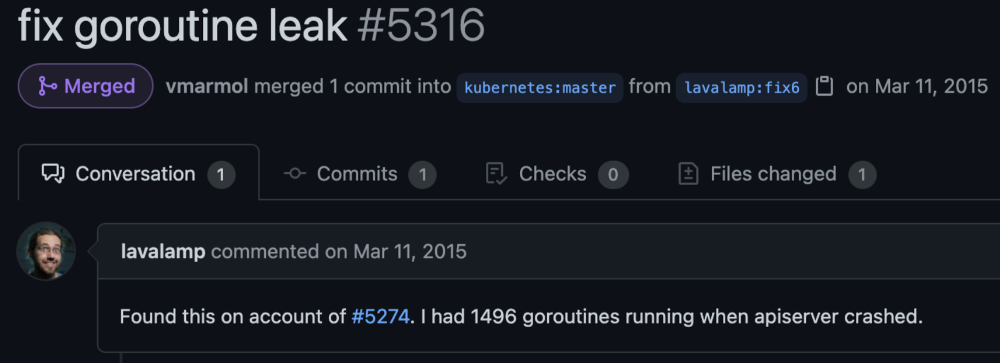
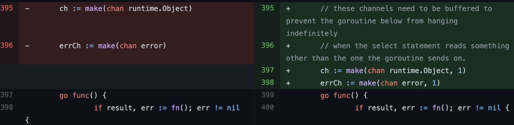
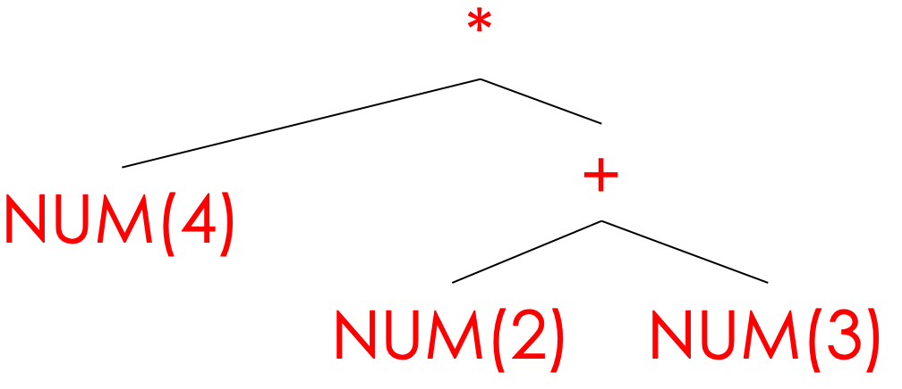
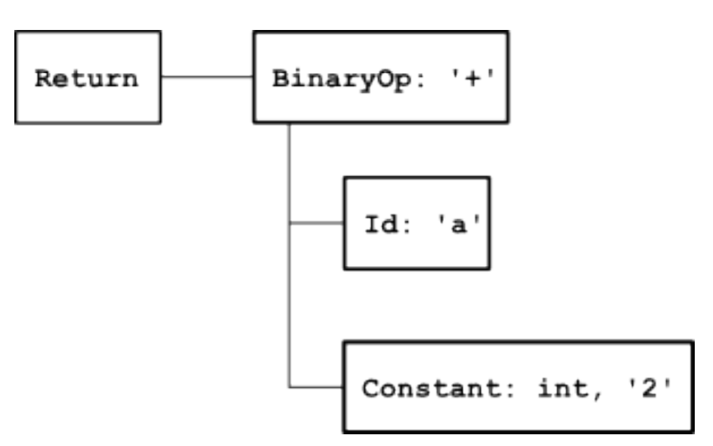
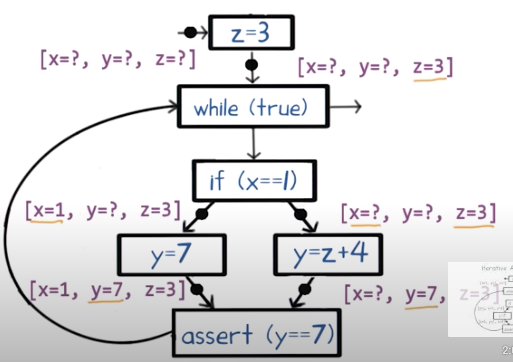
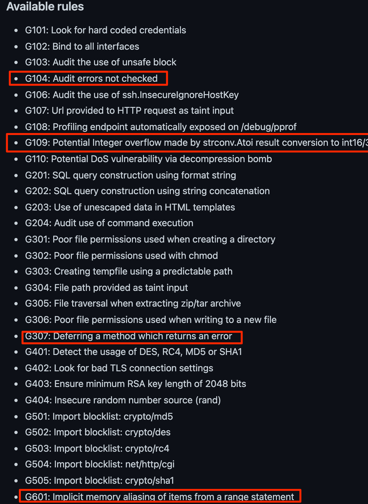
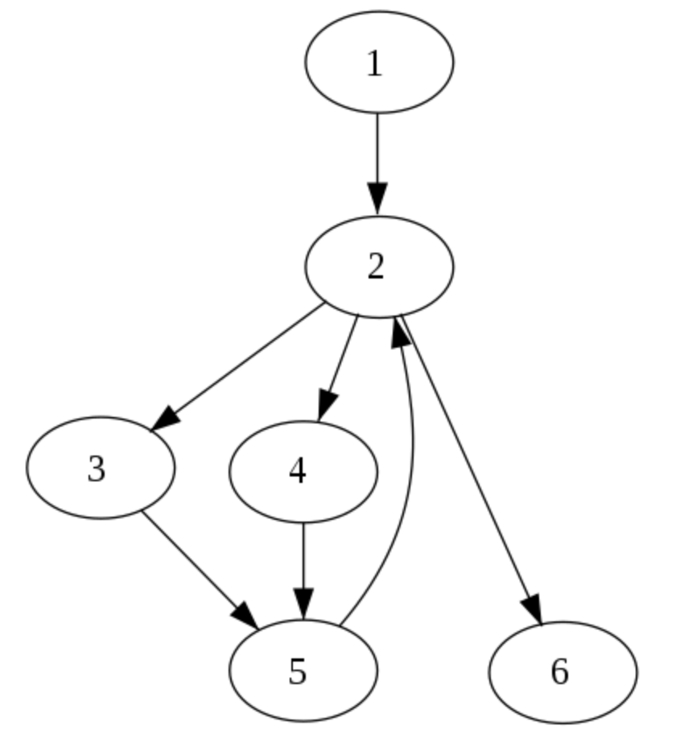
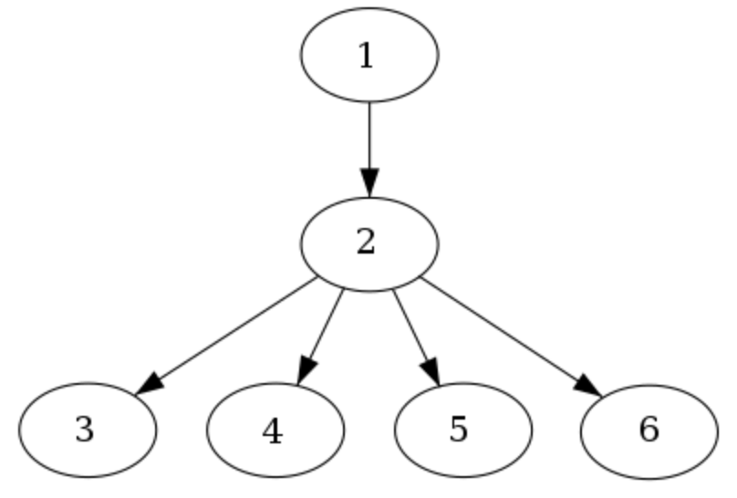
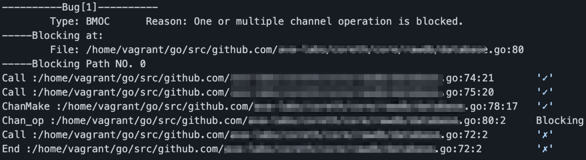

# Fuzzers, analyzers, and other **Gopher insecticides**

--- 
# whoami

* Lead security engineer @ Trail of Bits
* Been in security for over 6 years (professionally)
* Former software developer consultant
* Gopher
* Cachicamo

---
# So, what are we learning today? 

* Common bugs in Go code
* Fun edge cases
* Focus on concurrency bugs
* Techniques for catching them
    * Understand how they work
    * AST parsing vs. SSA analysis tools
    * How to choose your weapon
* Evaluate the state of security tooling for Go

---
# Why (practical answer)?

- Demystify how SCA tools work
- Core concepts to understanding how static analysis tools work in Go
- Helps us better compare tooling
    - Know what we can get from one tool that we cannot get from the other


---
# Why (soapbox version)?

## Screw private property of/greed for knowledge

--- 
## An ode to Go

- Garbage collected
- Strongly typed
- Makes concurrency easy
- Composition instead of inheritance
- Easy to read, easy to write

---

# Common **Go bugs**

---
## The comedy of **Go errors**

 ```go
_, err := verifyAccess()
g, err := getProfile()
if err != nil {
    return err
}
 ```

```go
if myVal, err := foo(); myVal != 0 {
    // code code code 
}
```

---
## The comedy of **Go errors**

- Error handling sucks in Go
- Awfully manual
- Copy/paste logic that can lead to mistakes, logic vulnerabilities

---
## Interface weirdness (nil-not-nil)

[.code-highlight: 6-10]
[.column]
```go
func main() {
    fmt.Println("file path: ")
    var filePath string
    fmt.Scanln(&filePath)

    err := PrintFile(filePath)
    if err != nil {
        myErr := err.Error() // Panic here
        fmt.Println(myErr)
    }
}
```

[.column]
```go
func PrintFile(filePath string) error {
    var pathError *os.PathError

    _, err := os.Stat(filePath)
    if err != nil {
        pathError = &os.PathError{
            Path: filePath,
            Err: errors.New("File not found"),
        }
        return pathError
    }
    content, _ := os.ReadFile(filePath)
    fmt.Println(string(content))

    return pathError
}
```
---
## **Integers**

```go
v, err := strconv.Atoi("4294967377")
        g := int32(v)
        fmt.Printf("v: %v, g: %v\n", v, g);
```

[Playground](https://play.golang.org/p/QzipABd1UTs)

---
## **Integers** [^1]

```go
func main() {
    res := dumbParse("E2147483650")
    fmt.Println("Result: ", res)

}

func dumbParse(s string) int32 {
    if len(s) > 1 && (s[0] == 'E' || s[0] == 'e') {
        parsed, err := strconv.ParseInt(string(s[1:]), 10, 64)
        if err != nil {
            return -1
        }
        return int32(parsed)
    }
    return 0
}
```

[^1]: [Playground](https://play.golang.org/p/dgVA9xeg3Z7)

## **Slices**

Slices are just views. They point to an array.

```go
func main() {
    a := []byte("bag")

    s1 := a[:]
    s2 := a[:]
    
    s1[2] = 'd'
    s2[2] = 't'
    
    
    fmt.Println(string(s1))
    fmt.Println(string(s2)) 
}
```

[Playground](https://play.golang.org/p/q5E3PZpXqY0)

## Type assertions

TODO

---

# Go concurrency

---

## The problem with **go concurrency**

- Writing concurrent code in Go is straightforward to do (for most use cases)
- So easy that sometimes concurrency is overused
- It is also easy to make mistakes that can lead to bugs

---

## Taxonomy of go **concurrency bugs**

| Category | Blocking | Non-Blocking |
| --- | --- | --- |
| Misuse of channels (message passing) | Goroutine leaks, improper use of context | Closing channels more than once, misuse of `select/case` blocks |
| Misuse of shared memory | Deadlocks, misuse of `Wait()` | Data races, slice bugs, misuse of anonymous functions, misuse of `WaitGroup`, misuse of special libraries |

---

### Common **data races** [^2]

[.column]
[.code-highlight: 3, 9, 5-8]
```go
func ConcurrentFunctions(fns ...func()) {
    var wg sync.WaitGroup
    for _, fn := range fns {
        wg.Add(1)
        go func() {
            fn()
            wg.Done()
        }()
    }

    wg.Wait()
}
```

[.column]
```go
func main() {
    ConcurrentFunctions(func1, func2)
}

func func1() {
    fmt.Println("I am function func1")
}

func func2() {
    fmt.Println("I am function func2")
}
```

[^2]: [Playground](https://play.golang.org/p/XcusIqRjhqr)

---
## Misuse of channels

---

### Go Channels

### **Channels**

[.column]
```go
func fibonacci(n int, c chan int) {
    x, y := 0, 1
    for i := 0; i < n; i++ {
        c <- x
        x, y = y, x+y
    }
    close(c)
}

```
[.column]
```go
func main() {
    c := make(chan int, 10)
    go fibonacci(cap(c), c)
    for i := range c {
        fmt.Println(i)
    }
}
```

---

### Channels & Select [^3]

[.column]
```go
func main() {
    finishReq(1)
    time.Sleep(time.Second * 5)
    fmt.Println(result)
    fmt.Println(runtime.NumGoroutine())
}

func test() string {
    time.Sleep(time.Second * 2)
    return "very important data"
}
```

[.column]
```go
func finishReq(timeout time.Duration) string { 
     ch := make(chan string,2)
    
    go func() {
        newData := test()
        ch <- newData // block 
    }()
    go func() {
        newData := test()
        ch <- newData // block 
    }()
    select {
    case result = <- ch:
        fmt.Println("case result")
        return result
    case <- time.After(timeout):
        fmt.Println("case time.Afer")
            return ""
    } 
}
```

[^3]: [playground](https://play.golang.org/p/D-zomNlWAy9)

---
### Goroutine Leaks [^4]

[.code-highlight: 2, 4-7, 8, 12-15]
```go
func finishReq(timeout time.Duration) string {
    ch := make(chan string)

    go func() {
        newData := test()
        ch <- newData // block
    }()
    select {
    case result = <- ch:
        fmt.Println("case result")
        return result
    case <- time.After(timeout):
        fmt.Println("case time.After")
            return ""
    }
}
```

[^4]: [Playground](https://play.golang.org/p/D-zomNlWAy9)

---
### So what?




---
## **Deadlocks** [^5]

[.column]
[.code-highlight: 2, 12]
```go
func (ms *myStruct) f() {
    ms.lock.Lock()

    ms.num += 1
    defer func() {
        if r := recover(); r != nil {
            fmt.Println("Recovered in f", r)
        }
    }()

    ms.g()
    ms.lock.Unlock()
}
```

[.column]
[.code-highlight: 6-8, 15]
```go
func main() {
    ms := myStruct{
        0,
        sync.Mutex{},
    } 
    ms.f()
    fmt.Println("Returned normally from f.")
    ms.f()
}

func (ms *myStruct) g() {
    fmt.Println(ms.num)
    if ms.num > 3 {
        fmt.Println("Panicking!")
        panic(fmt.Sprintf("%v", ms.num))
    }
     
    ms.num += 1
    ms.g()
}
```

[^5]: [playground](https://play.golang.org/p/NGW_7x_VpXL)

---
## Missing Unlocks [^6]

[.code-highlight: 4, 6-9, 13]
```go
func (ms *myStruct) evalEvenNumbers() error {
    fmt.Println("locking ms with num: ", ms.num)
    
    ms.lock.Lock()
    
    if ms.num % 2 != 0  {
        fmt.Println("no longer even")
        return fmt.Errorf("invalid")
    } 

    ms.num += 2

    ms.lock.Unlock()

    return nil
}
```

[^6]: [playground](https://play.golang.org/p/qr6ee8UwJzU)

---
## RLock double locks [^7]

> "If a goroutine holds a RWMutex for reading and another goroutine might call Lock, no goroutine should expect to be able to acquire a read lock until the initial read lock is released."

[^7]: [playgorund](https://play.golang.org/p/8ypdug7KQGR)

---
# This has been terrifying. **Now what?**


---
# The insecticides

- **Dynamic analysis**: Requires running the code or binary
- **Static Analysis (*)**: No need to run the application, though in many cases, your code must build

---

# Dynamic analysis tools I love

---
## Fuzzing

- Helps us find bugs in difficult to reach execution paths
- Generates random program input for a given target function
- Uses an initial corpus or set of input as seed data to create input values
- Complex parsing logic is usually a good use case

---
## Fuzzing Tools

- **Go-Fuzz**: coverage-guided fuzzing
- **Gofuzz**: provides many helper functions and type bindings
- **/trailofbits/go-fuzz-utils**: Interface to produce random values for various data types and can recursively populate complex structures from raw fuzz data generated by go-fuzz
- **`package fuzz`**: Native fuzzing package, still in Beta (available starting in Go 1.18)

^ uses program instrumentation to trace the code coverage reached by each input fed to a fuzz target.
^ To be demoed tomorrow

---
##  Fault Injection

- We use `krf`[^8] to inject faults in the SUT
- Intercepts syscalls, io operations, and injects faults
- Often useful to reveal error handling issues in Go

[^8]: [github.com/trailofbits/krf](https://github.com/trailofbits/krf)

---
## Other Tools

- [Gopter](https://github.com/leanovate/gopter): Property testing
- `package testing`: Native unit testing package 
- Go race detector: useful for catching some basic data races dynamically. 
- [go-deadlock](https://github.com/sasha-s/go-deadlock): Helps catch deadlocks dynamically

^ The go race detector won't catch deadlocks unless all mutex locks are locked

---
# Static Analysis: Welcome to the program analysis world

---
## Program Analysis

- Programs that reason about programs 
- Infer facts about a program by inspecting its code
- Without execution, for the most part (see Symbolic Execution)

---
## General Approach

1. Generate an abstract interpretation of code
2. Remove the stuff that is not important for your analysis
    a. Build an Abstract Syntax Tree
    b. Build Control Flow Graph for data flow analysis 
3. Conduct analysis on abstracted program

---
## AST

- Simplified syntactic representation of code 
- Discards grammar not needed for analysis (i.e. `while's and `for's are all loops)

      `4*(2+3)` ----------------------- `return a+2`




---
## CFG



---
## AST based tooling

- gosec
- errcheck
- ineffassign
- semgrep (*)
- ruleguard
- Go analyzers
- `go vet`

^ An assignment is ineffectual if the variable assigned is not thereafter used.

---
## Gosec



---
## Evaluating AST based tooling

- Simple issues are easy to catch fast with AST parsing
- Insecure usage of functions, configuration issues
- Lots of false positives 
- Lack of data flow analysis
- Great when intraprocedural analysis is sufficient

---
## AST analysis with Go

- `package go/ast`

---
## Data Flow Analysis with Go

- `golang.org/x/tools/go/ssa`

---
## SSA?

- static single-assignment
- IR representation used by Go
- Used by compiler to optimize code before generating Go assembly, conduct alias analysis, etc.
- builds a naive SSA form of the code
- determine dominator tree for each call
- we can now figure out execution paths by building call graphs
- allows us to answer questions like, "is parameter `foo' user-controlled?

---

## SSA Output

```go
package main
import "fmt"
const message = "Hello, World!"
func main() {
	fmt.Println(message)
}
```

```
func main():
0:                                                                entry P:0 S:0
	t0 = new [1]interface{} (varargs)                       *[1]interface{}
	t1 = &t0[0:int]                                            *interface{}
	t2 = make interface{} <- string ("Hello, World!":string)    interface{}
	*t1 = t2
	t3 = slice t0[:]                                          []interface{}
	t4 = fmt.Println(t3...)                              (n int, err error)
	return
```

---
## Dominator Trees



---
## SSA based tools

- **github/codeql-go**
- **system-pclub/GCatch**
- **stripe-archive/safesql**
- **go-kart**

---
## CodeQL

- Interprocedural analysis
- Taint tracking
- Steep learning curve
- Slow

---
## GCatch

- Catches concurrency bugs using SSA analysis
- Models Go structures for concurrency like channels
- Leverages Z3 for constraint solving
- Finds:
    - Goroutine leaks (misuse of channels)
    - Missing unlocks
    - Deadlock
    - Inconsistent field protections
    - Other concurrency bugs

---
## GCatch in action




---
## Semgrep (*) [^9]

- Intraprocedural analysis
- More than grep
- Uses generated tree-sitter grammars
- Can catch easy instances of issues found by GCatch (but faster)
- Missed 3/48 of BMOC bugs reported by GCatch to Moby/Docker
- 2/3 of missed bugs require interprocedural analysis


^ Trees sitters use CST (concrete syntax trees)
^ BMOC == blocking misuse of channel

[^9]: [trailofbits/semgrep-rules](https://github.com/trailofbits/semgrep-rules/)

---
## Semgrep [^10]

```yml
rules:
- id: missing-unlock-before-return
  patterns:
    - pattern-either:
      - pattern: panic(...)
      - pattern: return ...
    - pattern-inside: |
        $T.Lock()
        ...
        $T.Unlock()
    - pattern-not-inside: |
        $T.Unlock()
        ...
    - pattern-not-inside: |
        defer $T.Unlock()
        ...
  message: |
    Missing mutex unlock before returning from a function. 
    This could result in panics resulting from double lock operations
  languages: [go]
  severity: ERROR
```

[^10]: [Semgrep Playground](https://semgrep.dev/s/oY31)

---
# How about misuse of non-native packages?

---
## misuse of non-native packages: tooling

- We can use semgrep for a lot of use cases
- CodeQL for more in-depth analysis (slow)

---
## Insecure CSRF key with **Gorilla**

```go
import (
    "encoding/json"
    "net/http"

    "github.com/gorilla/csrf"
    "github.com/gorilla/mux"
)

var (
    key = []byte("insecurekey")
)

func main() {
    r := mux.NewRouter()
    
    csrfMiddleware := csrf.Protect(key)
    
    api := r.PathPrefix("/api").Subrouter()
    api.Use(csrfMiddleware)
    api.HandleFunc("/user/{id}", GetUser).Methods("GET")

    http.ListenAndServe(":8000", r)
}
```

---
## Overly Permissive CORS with **Gorilla**

```go
import (
    "net/http"
    "io"
    "github.com/gorilla/handlers"
)

var (
    tooPermissive  = []string{"*"}
)
func main () {
    serveMux := http.NewServeMux()
    
    originHeaders := handlers.AllowedOrigins(tooPermissive)

    serveMux.HandleFunc("/", func(w http.ResponseWriter, r *http.Request) {
        io.WriteString(w, "Hello World!")
    })

    http.ListenAndServe(":8080", handlers.CORS(originHeaders)(serveMux))
}
```

---
## Insecure use of **Gorm**

```go
db.Exec("INSERT INTO people (name) VALUES(\""+uname+"\")")
// (...)
db.Raw("SELECT id, name, age FROM users WHERE name = ?", userName)
```

---
## **Gotico**

- In-development
- Analyzers for 
    - Gin
    - Gorilla
    - Tendermint
    - Gorm
- Relies heavily on AST parsing
- Building SSA support for answering basic questions 
- Basic demo tomorrow

^ the use of SSA here is greatly motivated by a need to reduce false positives

---
## Why not just stick to semgrep and CodeQL

- A custom solution allows us to control the logic for each bug
- This is often needed given how different packages are used 
- **Goal**: make it as easy as possible to write new rules
- **Goal**: so easy it encourages others to contribute new rules

---
## Wrap up

- Leverage dynamic analysis as much as possible
    - Review unit tests
    - Fuzz complex logic
    - Test edge cases with `krf`
- Use AST tools for finding common misuse of native packages, interprocedural analysis
- Use SSA based tools for complex bugs that require intraprocedural analysis reduced FPs
- Use Semgrep, CodeQL, ruleguard when custom rules are needed (and finding instances of a specific issue)

---
## Build your own

- Or contribute to existing tools

---
## Tomorrow

- We will dig deeper into some of the issues discussed
- Use GCatch to discover Go routine leaks
- Learn how to use go-fuzz
- Sneak peak into Gotico, and how I am developing it

---
## Resources

- [trailofbits/not-going-anywhere](https://github.com/trailofbits/not-going-anywhere)
- [amit-davidson/GopherCon2021IsraelStaticAnalysisWorkshop](https://github.com/amit-davidson/GopherCon2021IsraelStaticAnalysisWorkshop)
- [Introduction to Automated Analysis](https://www.coursera.org/learn/automated-analysis)
- [Software Analysis & Testing - Georgia Tech](https://www.udacity.com/course/software-analysis-testing--ud333)
- [SSA Book](http://ssabook.gforge.inria.fr/latest/book.pdf)
- [SSA Plygroud](https://golang.design/gossa)